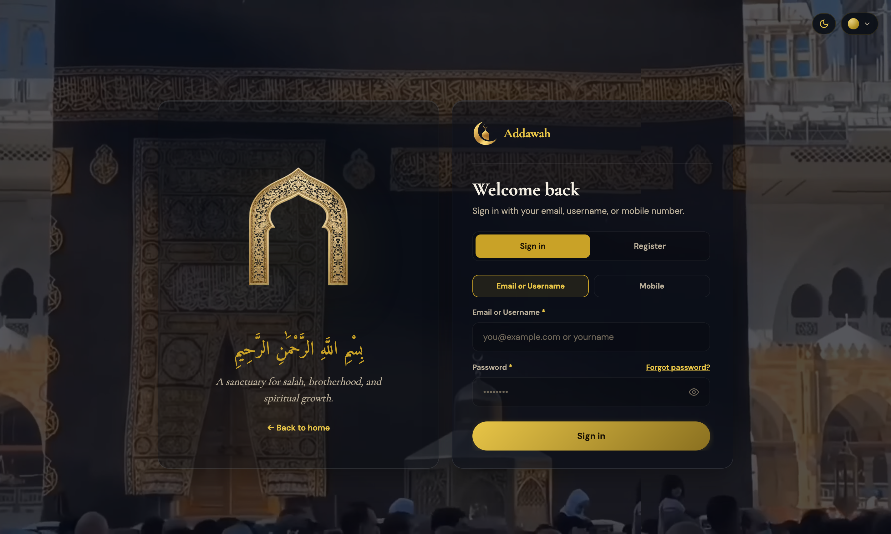
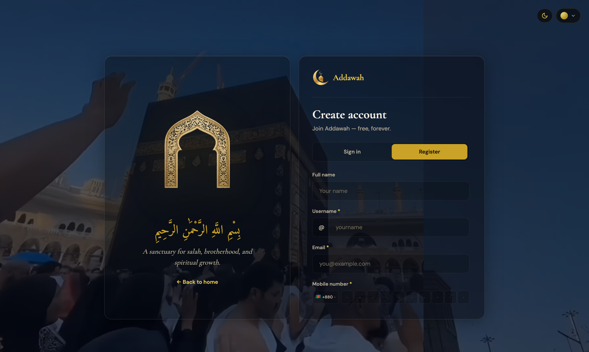
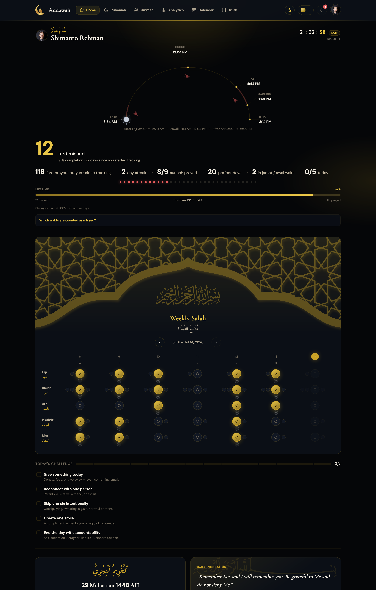
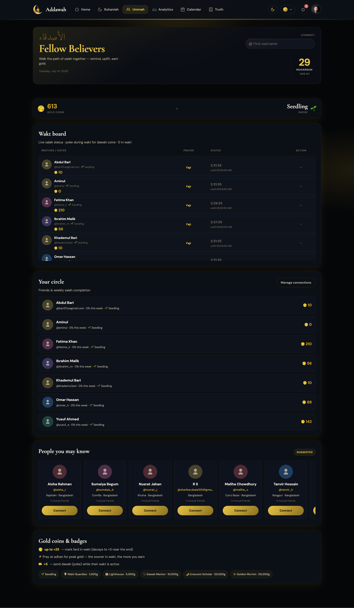
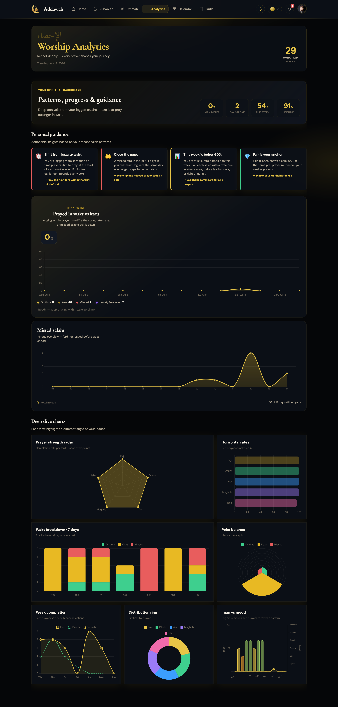
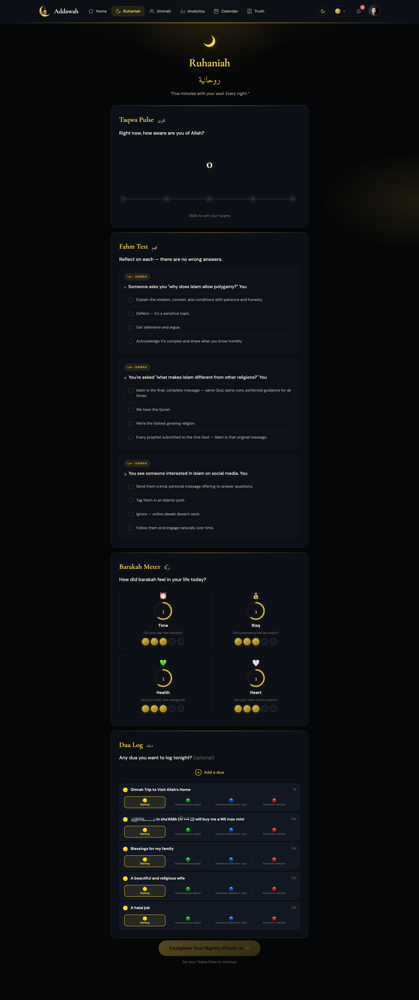
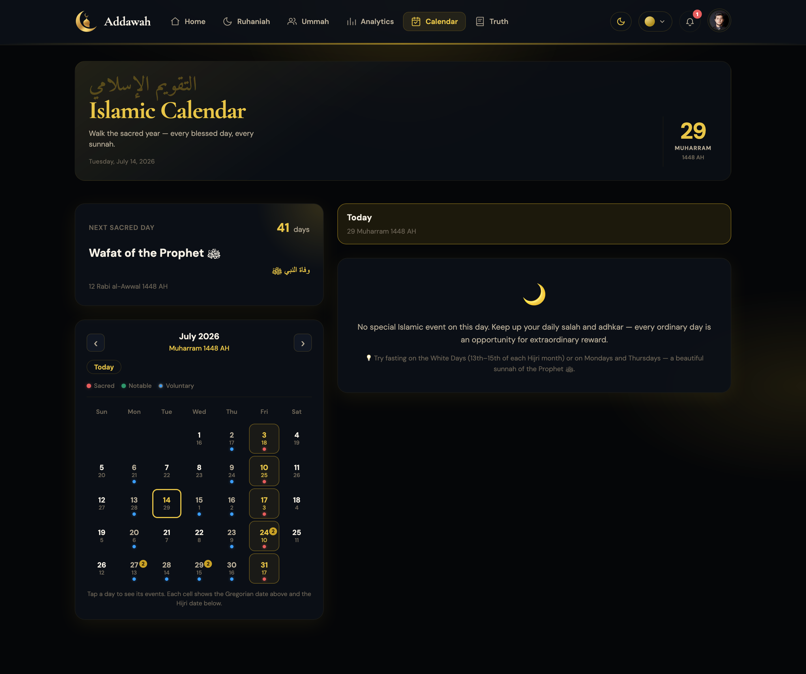
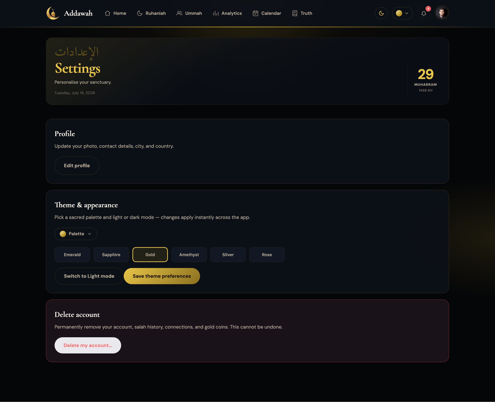
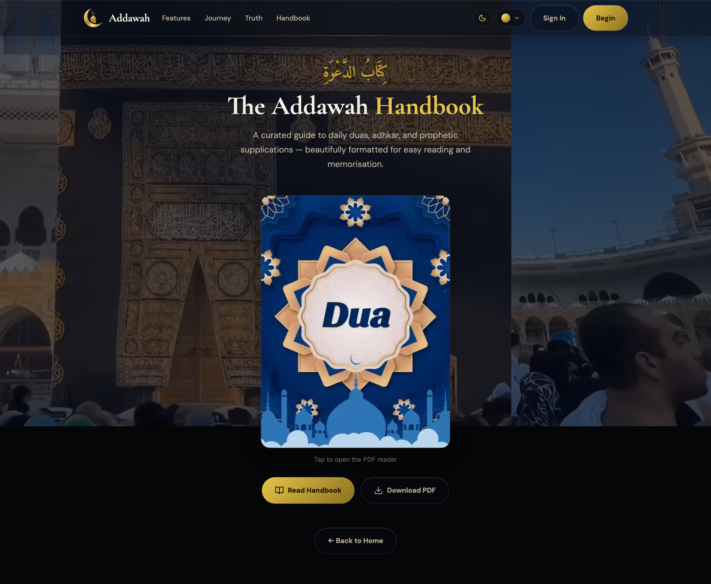

# DAWA — Business Requirements Document (BRD)

## Version 4.27

**Tagline:** Pray Together. Grow Together. Inspire Each Other.

## Overview

Dawa is a free Islamic web platform focused on:
- Salah Tracking
- Accountability
- Daily Islamic Inspiration
- Community Support
- Habit Building
- Worship Analytics
- Spiritual Growth (Ruhaniah)
- Public reflections (**Truth**) & Handbook

The MVP runs entirely on free-tier infrastructure.

## Product Screenshots

Reference UI captures stored in `public/assets/images/readme/`.

### Landing & authentication

| Landing | Sign in | Register |
|:---:|:---:|:---:|
|  |  |  |

### Authenticated product surfaces

| Dashboard | Believers (Ummah) | Analytics |
|:---:|:---:|:---:|
|  |  |  |

| Ruhaniah | Calendar | Settings |
|:---:|:---:|:---:|
|  |  |  |

### Handbook



## Recommended Free Stack

- **Frontend:** Next.js 14 + React + TypeScript
- **UI:** Hand-written BEM `dawa-*` CSS + custom Islamic gold theme + Framer Motion
- **Backend:** Next.js API Routes + Server Actions
- **ORM:** Prisma
- **Database:** Neon PostgreSQL (Free)
- **Authentication:** Session auth (JWT cookie)
- **Storage:** Vercel Blob (Free) — avatar uploads
- **Email:** Resend Free — OTP, transactional, and Truth contact form
- **Hosting:** Vercel
- **Charts:** Chart.js (react-chartjs-2)
- **Data Fetching:** SWR
- **Validation:** Zod
- **Logging:** Pino
- **Virtualization:** TanStack Virtual

## Core Features

### 1. Authentication & Profile
- Email + password registration and login (also username / mobile sign-in)
- Session-based auth with JWT cookies
- User profile with avatar, bio, location (city/country)
- Profile privacy controls (what others can see)
- Username-based public profiles (`/u/[username]`)
- Username availability checking
- Password reset via OTP (email-based)
- Account deletion with OTP verification
- Avatar upload & color-based fallback

### 2. Salah Tracking
- Weekly salah tracker with 5 prayers × 7 days
- Fard, Sunnah before, Sunnah after tracking
- On-time vs kaza vs missed classification (evaluated in the user's **prayer timezone**)
- **Sticky on-time (`completedOnTime`):**
  - Set when a fard prayer is first marked **inside** its wakt window
  - Survives uncheck and later re-mark (even outside the wakt) — never demoted to kaza
  - A prayer that was **never** marked inside the wakt remains kaza when marked late
- Iman meter calculation (on-time prayers boost, kaza/missed lower)
- Prayer time awareness (prevents marking before wakt starts)
- Celebration confetti on completion
- Missed fard bead visualization (33 beads)
- Precomputed per-day stats (`UserSalahDayStat`) for fast reads
- Optimistic UI updates with cache invalidation
- Salah POST may return `timing: 'on-time' | 'kaza'` for fard marks

### 3. Dashboard & Statistics
- Hero statistics card (today, week, streak, lifetime, sunnah prayed, perfect days)
- Missed fard count with bead visualization (capped breakdown preview)
- Progress bar with lifetime completion rate
- Hijri calendar display
- Daily Islamic inspiration quotes
- Sun path arc showing prayer times visually
- Prayer insights with trend analysis & coaching tips
- Mood check-in tracking
- Wakt countdown clock in header

### 4. Analytics
- KPI cards (Iman meter, streak, week rate, lifetime rate)
- Iman meter line chart (14-day trend)
- Missed salah area chart (14-day overview)
- Wakt breakdown doughnut (on-time vs kaza vs missed)
- On-time bar chart (weekly)
- Mood history tracking
- Personal coaching tips
- Daily Challenge integration (rotating deeds + week chart)

### 5. Friends & Brotherhood
- Friend system with connection requests
- Friend suggestions based on mutual connections
- Wakt board — live salah status of friends
- Virtualized friend list (TanStack Virtual) for smooth scrolling
- Precomputed wakt snapshots (`UserWaktSnapshot`) for fast board reads
- Snapshot refresh on salah change + stale-while-revalidate on read
- Gentle reminder (poke) system with cooldown
- Gold coin economy for wakt salah and dawah
- Badge tiers (Seedling → Scholar) based on coin balance
- Username search with availability checking
- Public user profiles with prayer charts & insights

### 6. Notifications
- Real-time notification panel with unread count badge
- Notification types: connection requests, pokes, dawah reminders, wakt reminders, ruhaniah reminders
- Mark as read / mark all read
- Deduplication via `dedupeKey`

### 7. Ruhaniah (Spiritual Check-in)
Nightly spiritual check-in system with 4 input steps and 3 output sections.

#### Inputs:
- **Taqwa Pulse** — self-assessment slider (1-5: Ghaflah → Ihsan)
- **Fahm Test** — 3 random questions from 320-question bank (8 categories × 40 questions)
- **Barakah Meter** — rate 4 areas (Time, Rizq, Health, Heart) on 1-5 scale
- **Dua Log** — add new duas with categories (Rizq, Health, Relationships, Guidance, Forgiveness, Jannah, Dunya, Custom)

#### Outputs:
- **Quran Verse** — personalized verse from 300-verse pool, selected based on spiritual signals
- **Spiritual Weakness Analysis** — severity-ranked areas (critical/high/moderate) needing attention
- **Insights Dashboard** — Fahm Radar (8-axis), Taqwa Trend (30-day line), Barakah Trend (4-line), Dua Timeline

#### Fahm Categories:
| Category | Measures |
|----------|----------|
| QADR | Trust in destiny |
| TRUTH | Honesty & integrity |
| DAWAH | Sharing deen with others |
| NAFS | Self-control & desires |
| AKHIRAH | Focus on afterlife vs dunya |
| SABR_SHUKR | Patience & gratitude |
| ILM | Seeking Islamic knowledge |
| SOCIAL | Treating people well |

#### Verse Selection Engine:
Gathers spiritual signals from 8 sources → converts to semantic tags → scores 300 verses → selects best match.

**Signal Sources:**
1. Salah completion — `obedient`, `neglectful`, `needs_reminder`
2. Jamat/Awal Wakt sincerity — `sincere`, `devoted`, `jamat_strong`, `needs_jamat`
3. Taqwa score — `heedless`, `distracted`, `conscious`, `present`
4. Fahm weakest category — `anxious`, `shy_deen`, `impatient`, `dunya_focused`
5. Barakah scores — `time_restricted`, `restless_heart`, `health_struggling`
6. Active duas — `waiting_many`, `needs_sabr`, `answered_dua`
7. Mood — `anxious`, `grateful`, `sad`
8. Prayer streak — `strong_streak`, `relapse`, `needs_hope`

### 8. Truth (Public Reflections)
Passages and stories connecting science, philosophy, and revelation.

#### Content
- Expandable passage cards + full-bleed feature rows (scroll-expand gradient wraps)
- Salah story timeline (five postures)
- Founder / “the one behind it” section
- **Let's talk** contact form — validated name (letters only, no digits) + email (format tick) + message; sends inbound email to the founder inbox via Resend/SMTP; Reply-To = submitter; rate-limited

#### Dual shell (same URL `/truth`)
- **Guest:** public layout — landing video backdrop + PublicNav
- **Signed-in:** middleware rewrite to app shell — AppHeader / Islamic backdrop (no landing video); session preserved
- Desktop app nav includes Truth; Settings remain in the account menu; mobile shows Truth in the account menu (not the tab bar)

### 9. Handbook
- Public PDF handbook reader with thumbnail preview, fullscreen viewer, and download

### 10. Theming & UX
- 6 theme colors (Green, Blue, Gold, Purple, Silver, Pink)
- Dark & Light modes
- Framer Motion animations throughout
- Shimmer/skeleton loading states for data-fetching components
- Truth route skips the generic dashboard auth shimmer
- App preloader animation on first visit
- Responsive design (mobile-first)
- Accessibility: `prefers-reduced-motion` support, ARIA labels, screen reader text

### 11. SEO & Metadata
- JSON-LD structured data
- Dynamic sitemap
- Robots.txt
- Open Graph metadata
- PWA manifest

### 12. Settings
- Theme selection
- Account deletion (with OTP verification)
- Profile privacy matrix
- Reachable from the account menu (desktop + mobile)

### 13. Islamic Calendar (Hijri)
- Month grid view: Gregorian calendar with Hijri date annotations and event significance indicators
- Today's events: automatic detection of special Islamic days (Jumu'ah weekly, Hijri New Year, Ashura, Mawlid, Isra/Mi'raj, Ramadan, Eid al-Fitr, Eid al-Adha, Day of Arafah, Days of Tashriq, Laylat al-Qadr, etc.)
- Sunnah checklist: per-event action items (fasting, prayer, charity, reflection) with gold coin rewards (5–15 coins per action)
- Countdown to next sacred day with Hijri date target
- Story of the day: significance, short history, and Quran references for each event
- Consistency tracking: 14-day rolling completion rate feeds Ruhaniah spiritual weakness analysis
- Calendar sunnah deeds displayed in analytics week completion chart
- Static event data in `public/data/islamic-events.json` (19 events, zero DB queries for reads)
- Bitmap mask storage (`CalendarTaskCompletion`) — one row per user per day, consistent with DailyChallenge pattern
- Mobile navigation: calendar replaces notifications in bottom tab bar; notifications moved to avatar menu

### 14. Navigation (App Shell)
| Surface | Items |
|---------|--------|
| Desktop header | Home, Ruhaniah, Ummah, Analytics, Calendar, Truth |
| Mobile tab bar | Home, Ruhaniah, Ummah, Analytics, Calendar |
| Account menu | Profile, Settings, Truth (mobile), Analytics, Notifications, Sign out |

## Data Files

| File | Content | Purpose |
|------|---------|---------|
| `public/data/ayah-pool.json` | 300 Quran verses | Verse selection for Ruhaniah |
| `public/data/fahm-questions.json` | 320 questions | Fahm psychometric test |
| `public/data/islamic-events.json` | 19 Islamic events | Hijri calendar events with sunnah actions, rewards & Quran refs |
| `public/assets/images/truth/` | Passage & founder imagery | Truth page media |
| `public/assets/images/readme/` | Product screenshots | README / BRD gallery |
| `docs/FAHM_QUESTION_BANK.md` | Human-readable question bank | Reference for categories & scoring |

## Verse Pool Coverage (30 Tags)

The 300 verses cover 30 spiritual state tags:

```
answered_dua, anxious, conscious, consistent, control_seeking,
distracted, dunya_focused, grateful, health_struggling, heedless,
impatient, nafs_weak, needs_comfort, needs_courage, needs_hope,
needs_reminder, needs_sabr, needs_shukr, neglectful, obedient,
present, relapse, restless_heart, rizq_blessed, sad, shy_deen,
social_deen_weak, strong_streak, time_restricted, waiting_many
```

Each verse has:
- Arabic text
- English translation (Sahih International — public domain)
- Tafsir (explanation)
- Reflection template (personalized with user data)
- Dawah template (for sharing with others)
- Primary tags (worth 3 points in scoring)
- Secondary tags (worth 1 point in scoring)

## Database Schema

### Core Models
| Model | Purpose |
|-------|---------|
| `User` | Account with profile, theme, coins, privacy |
| `Session` | JWT session tokens |
| `SalahRecord` | Prayer records (Fard/Sunnah); sticky `completedOnTime`; optional `inJamat` |
| `UserSalahDayStat` | Precomputed daily stats for fast analytics |
| `UserWaktSnapshot` | Precomputed live wakt status for friends board |

### Social Models
| Model | Purpose |
|-------|---------|
| `Friendship` | Friend connections (pending/accepted) |
| `Poke` | Gentle reminders between friends |
| `Notification` | All notification types (with dedup) |

### Ruhaniah Models
| Model | Purpose |
|-------|---------|
| `TaqwaPulse` | Daily spiritual self-assessment (1-5) |
| `FahmQuestion` | Question bank (320 questions, 8 categories) |
| `FahmResponse` | User's Fahm test answers |
| `UserFahmProfile` | Aggregated Fahm scores, trends, strongest/weakest |
| `BarakahLog` | Daily barakah ratings (Time, Rizq, Health, Heart) |
| `DuaEntry` | Personal duas with status (Waiting, Answered, Stored) |
| `RuhaniahVerse` | Daily personalized Quran verse & reflection |

### Other Models
| Model | Purpose |
|-------|---------|
| `MoodCheckIn` | Daily mood tracking |
| `AccountDeletionOtp` | OTP for account deletion |
| `PasswordResetOtp` | OTP for password reset |
| `DailyChallenge` | Daily rotating challenge tasks with bitmap mask |
| `CalendarTaskCompletion` | Islamic calendar sunnah action completions (bitmap mask per day) |

## Shimmer Loading System

All data-fetching components use skeleton placeholders while loading:

| Component | Shimmer Type |
|-----------|-------------|
| HeroStats | Hero number, subtitle, stream values, beads, progress bar |
| PrayerInsights | Chart placeholders, gauge value |
| SalahTracker | Table grid with prayer rows |
| ProfilePrayerCharts | All 4 chart types |
| AnalyticsHub | KPI cards, dynamic import fallbacks |
| NotificationPanel | Notification list items |
| ManageConnections | Connection list items |
| FriendsHub | Hero section, friends list |
| PublicUserProfile | Profile card, stat grid |
| UsernameSearch | Search result rows |
| AppLayoutClient | Full page skeleton (skipped on `/truth`) |

## Performance Optimizations

- Precomputed `UserSalahDayStat` — avoids recalculation on every analytics read
- Precomputed `UserWaktSnapshot` — avoids prayer-time API calls per friend on board read
- Optimistic UI updates for salah marking
- Parallel database operations where possible
- SWR cache invalidation on mutations
- Virtualized lists for large friend lists (TanStack Virtual)
- Batched friend queries with pagination (cursor-based)
- Truth scroll-expand: shared rAF registry for GradientWrap instances

## Long-term Vision

- Flutter mobile app
- Family circles
- Qibla finder
- Mosque locator
- Zakat calculator
- Study groups
- AI-powered Islamic assistant with references
- More Truth passages over time (copy never hardcodes a fixed passage count)
